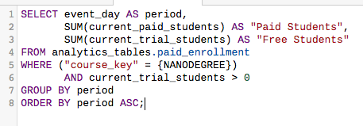

# Logs Analysis Project Overview

You've been hired onto a team working on a newspaper site. The user-facing newspaper site frontend itself, and the database behind it, are already built and running. You've been asked to build an internal reporting tool that will use information from the database to discover what kind of articles the site's readers like.

The database contains newspaper articles, as well as the web server log for the site. The log has a database row for each time a reader loaded a web page. Using that information, your code will answer questions about the site's user activity.

The program you write in this project will run from the command line. It won't take any input from the user. Instead, it will connect to that database, use SQL queries to analyze the log data, and print out the answers to some questions.

## Why this project?

In this project, you will stretch your SQL database skills. You will get practice interacting with a live database both from the command line and from your code. You will explore a large database with over a million rows. And you will build and refine complex queries and use them to draw business conclusions from data.

### Report generation

Building an informative summary from logs is a real task that comes up very often in software engineering. For instance, at Udacity we collect logs to help us measure student progress and the success of our courses. The reporting tools we use to analyze those logs involve hundreds of lines of SQL.

### Database as shared resource

In this project, you'll work with data that could have come from a real-world web application, with fields representing information that a web server would record, such as HTTP status codes and URL paths. The web server and the reporting tool both connect to the same database, allowing information to flow from the web server into the report.

This shows one of the valuable roles of a database server in a real-world application: it's a point where different pieces of software (a web app and a reporting tool, for instance) can share data.

|  | 
|:--:| 
| *Just one of many queries Udacity uses for logs analysis.* |
